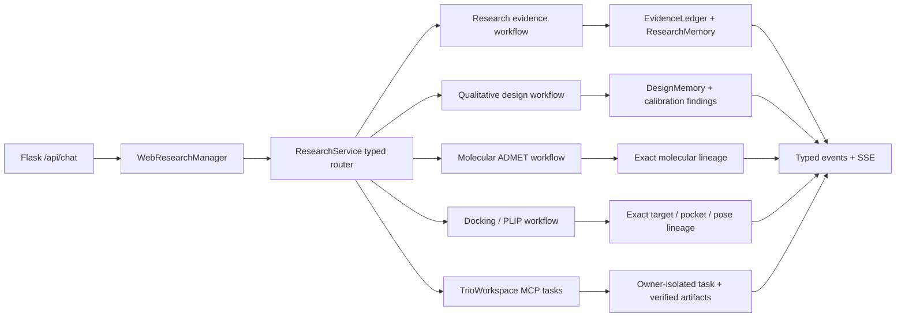
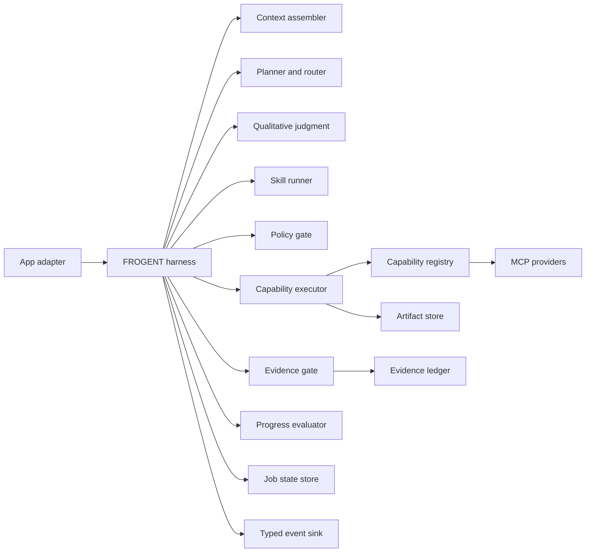

# FROGENT Harness

## 定义

FROGENT harness 是围绕模型、Agents、Skills、Apps 和 MCP providers 的控制系统。它负责一次 job 的 context 装配、规划、路由、策略检查、工具执行、evidence 准入、状态推进、事件输出、停止判断与恢复。

模型负责提出下一步意图。harness 决定该意图能否执行、执行结果进入哪个数据层、哪些内容允许进入工作 memory，以及 job 何时结束。

## 当前闭环

当前 runtime 已具备 typed research、design、molecular 与 docking paths，bounded conversation context，
evidence admission/revocation、project-contained artifacts、persistent research/conversation/design memory、
typed events、safe partial failures，以及默认无固定墙钟 timeout 的 provider 与模型边界。

TrioWorkspace 通过 project-contained stdio MCP 接入五个私有异步引擎。Harness 先保存 typed
submission 与 task ID，再轮询 owner-isolated 状态；成功结果只以 byte-size/SHA-256 校验后的
project-local artifact references 进入后续判断。HMAC secret 在远端一次性 relay 内使用，本地
runtime、Skills、events 和模型上下文都不接触该凭据。

当前仍需继续收敛的架构点：

- 混合 research + design + molecular/docking 请求需要组合能力计划，当前自动路由仍以单一路径为主。
- `DesignCalibrator` 已提供 typed production hook，具体 calibration request 只有在适配的 executor
  已配置并且结构、target、pocket 或 evidence 输入充分时才执行。
- Quantitative design 已生成 typed optimizer handoff；实际 evolutionary、Bayesian optimization 或 RL
  executor 仍需稳定 capability 与结果回流接口。
- Attachment metadata 已进入 app boundary，design 与 molecular reasoning 仍需按 artifact policy 选择内容。

## 目标组件

| Component | Single responsibility |
|---|---|
| App adapter | Authenticate, normalize requests, stream events, expose artifacts |
| Harness controller | Apply transitions and budgets; own the job loop |
| Context assembler | Load bounded user input, approved evidence IDs, artifact refs, and required history |
| Planner and router | Emit typed commands with reasons and targets |
| Qualitative judgment | Classify the decision regime; generate and rank knowledge-led hypotheses before calibration |
| Skill runner | Activate task procedures without owning provider URLs |
| Policy gate | Check phase, capability allowlist, limits, consent, and data boundaries |
| Capability executor | Resolve stable capability IDs and normalize provider results |
| Evidence gate | Preserve raw records, apply screening decisions, admit qualified excerpts |
| Progress evaluator | Measure task progress, detect repetition, request input, or stop |
| Stores | Persist state, artifacts, evidence, and traces through separate interfaces |
| Event sink | Convert typed events to SSE, WebSocket, CLI, or test traces at the boundary |

## Job loop

1. Create `ExecutionContext` and snapshot an exact evidence `as_of` date.
2. Enter `intake`; validate the request, files, identity, consent, and job limits.
3. Assemble a bounded context from user input, approved evidence IDs, artifact references, and the minimum necessary conversation state.
4. Enter `planning`; activate the relevant Skills and produce a typed `HarnessCommand`.
5. Classify the decision as `qualitative`, `quantitative`, or `hybrid`. A discriminator qualifies only when it matches the user's objective, is calibrated for the current domain, and covers the candidate space.
6. For qualitative or hybrid work, create a typed `HypothesisPortfolio` inside planning. Generate it from world knowledge, medicinal-chemistry experience, mechanistic reasoning, and verified precedent before broad scoring; expose the action as a `judgment` Agent event.
7. Apply `HarnessPolicy` and the phase-transition table before delegation or capability execution.
8. Execute one command. Store large or raw results as artifacts and return a normalized `ToolResult`.
9. Use tools to validate identity, catch hard conflicts, calibrate confidence, and rerank hypotheses. An unavailable or inconclusive tool leaves a knowledge-led hypothesis active; an immutable-constraint violation or hard contradiction can reject it.
10. Route literature results through `EvidenceLedger`. Keep excluded and uncertain factual records outside working memory while retaining clearly labeled design hypotheses in the decision portfolio.
11. Reconcile admitted evidence after every new screening decision, correction, or retraction.
12. Enter `evaluation`; measure progress, hypothesis diversity, decision usefulness, repeated actions, errors, and remaining budget.
13. Persist a checkpoint and emit typed events. Continue, request input, complete, fail, or honor cancellation.

One loop iteration performs one externally visible decision. This keeps traces replayable and avoids recursive Agent-to-Agent execution.

## State and memory boundaries

`HarnessState` stores control data only: `run_id`, `as_of`, phase, counters, admitted evidence IDs, last target, and error. Raw prompts, full documents, provider payloads, model traces, and tool outputs stay outside the state object.

| Layer | Contents | Context eligibility |
|---|---|---|
| Conversation history | User-visible messages | Selected by context policy |
| Job state | Phase, limits, IDs, checkpoints | Always small |
| Artifact store | Files and raw provider payloads | Referenced on demand |
| Evidence ledger | Raw records and all screening events | Queried for audit or screening |
| Working memory | Qualified evidence excerpts and task facts | Directly available to planner |
| Design memory | User-grounded constraints, full hypothesis portfolio, calibration findings, rank revisions, answer versions | Available to design resume and recalibration |
| Synthesis | Claims linked to evidence and counterevidence IDs | Available after validation |

Local memory is scoped by `user_id`, `conversation_id`, and `job_id`. Promotion to longer-lived memory requires an explicit policy and provenance-preserving summary.

## Stop and recovery policy

The harness stops on a completed acceptance condition, required user input, user cancellation, policy denial, exhausted budget, repeated no-progress actions, an unrecoverable provider failure, or the absence of any actionable hypothesis after hard constraints are applied. Missing prediction coverage alone does not stop qualitative judgment. Every stop carries a reason and final phase.

Checkpoint after each tool result, evidence decision, design revision, and synthesis update. A resumed job reloads IDs and state, reconciles evidence eligibility, rehydrates artifacts through references, and deterministically rerenders saved design findings without regenerating the portfolio.

## Evaluation surface

Deterministic tests cover transitions, capability allowlists, budgets, memory admission, evidence revocation, and typed events. Scenario evaluations should cover anchor-record recall, near-miss retention, negative evidence, duplicate study families, preprints, corrections, retractions, provider errors, cancellation, and concurrent jobs.

Useful trace metrics include unsupported factual-claim rate, citation precision, anchor recall, screening agreement, hypothesis diversity, recommendation stability after calibration, hard-block accuracy, experiment value, memory admission count, evidence revocations, tool failure rate, and time to an acceptance condition.

定性科学判断的逐层实现矩阵、五案例语义评估及其 claim limits 见
[QUALITATIVE_JUDGMENT.md](QUALITATIVE_JUDGMENT.md)。

## Remaining integration sequence

1. Compose mixed literature, qualitative judgment, ADMET and docking requests into one bounded capability plan.
2. Bind admitted evidence IDs and computational artifact IDs directly to design hypotheses.
3. Add executable quantitative optimizer capabilities with objective, constraint, applicability-domain and stop-rule lineage.
4. Add hypothesis supersession/revocation controls for experimental feedback.
5. Extend semantic scenario evaluations across new molecule, peptide, target and route decisions.
