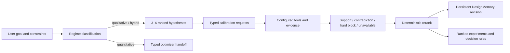

# Qualitative Scientific Judgment

## Product intent

FROGENT serves scientific decisions that remain underdetermined before new experiments. The Agent uses
world knowledge, medicinal-chemistry or peptide experience, mechanistic reasoning, and domain intuition
to create a differentiated, ranked experimental portfolio. Tools challenge and calibrate that portfolio.

Every request is classified into one of three regimes:

- `qualitative`: no reliable discriminator covers the important design choices; the Agent leads.
- `hybrid`: tools resolve selected liabilities or constraints while the Agent ranks the remaining choices.
- `quantitative`: an objective-aligned, calibrated discriminator covers the design space; a typed optimizer
  handoff leads, with expert judgment retained for residual scientific choices.

The user-facing order is recommendation, expected benefit, tradeoff, failure mode, confidence, and the
most informative experiment. Uncertainty changes rank, confidence, portfolio breadth, or experiment
choice. It does not silently erase an actionable hypothesis.

## Alignment matrix

| Layer | Current implementation | Status |
|---|---|---|
| Project instructions | Root `AGENTS.md` requires knowledge-led judgment, typed regime classification, tool calibration, ranked recommendations, and minimal useful uncertainty. | Implemented |
| Product manifest | The root product manifest declares qualitative scientific judgment and persistent memory as product capabilities. | Implemented |
| Auto routing | Common analogue, SAR, bioisostere, scaffold-hop, peptide, and Chinese design actions enter the design path. Literature markers preserve research routing. Constraint-only messages enter design context. | Implemented |
| Context assembly | The strategist receives the current request plus at most eight bounded conversation turns. User constraints must be exact spans tied to a user turn. | Implemented |
| Decision regime | `DecisionContext` validates qualitative, hybrid, and quantitative states. Quantitative state requires a complete typed optimizer handoff. | Implemented |
| Hypothesis generation | The strategist contract requires 3–6 differentiated actions for qualitative or hybrid work, each with rationale, benefits, tradeoffs, failure modes, knowledge basis, calibration requests, confidence, and a decisive experiment. | Implemented |
| Semantic recovery | One schema-bound repair is allowed when the first strategist object fails semantic validation. A second failure remains visible and recoverable. | Implemented |
| Tool calibration | Every hypothesis carries typed capability requests and decision rules. An injected calibrator returns support, contradiction, hard-block, or unavailable findings. Findings cause deterministic reranking. | Implemented hook; concrete executor coverage is partial |
| Tool outage | Unavailable findings preserve active recommendations and lower evidential support. Calibrator failure returns a useful portfolio plus a recoverable error. | Implemented |
| Evidence boundaries | Knowledge basis, computational signals, literature evidence, and experimental facts remain distinct concepts. Literature facts still require admitted evidence. | Implemented in research; direct evidence-ID binding to design hypotheses is pending |
| Persistent design memory | SQLite state stores the full portfolio, constraints, findings, answer versions, revision, and bounded context by user and conversation. Same-state resume rerenders without another model call. | Implemented |
| Experimental revision | Tool findings can revise and persist ranks through `apply_findings`. | Implemented |
| Hypothesis supersession | Explicit revoke or supersede semantics for individual design hypotheses after wet-lab results are not yet available. | Pending |
| Peptide workflow | Target-bound and membrane, phenotypic, stability, or target-independent branches are separate. AMP optimization can proceed without protein docking. | Implemented |
| Target discovery | Verified relations remain factual evidence; clearly labeled causal or mechanistic hypotheses remain allowed with a validation query or experiment. | Implemented |
| Retrosynthesis | Expert reagent classes and condition families may be proposed as hypotheses. Reported conditions and yields still require verified sources. | Implemented |
| Literature handoff | The literature Skill can hand admitted evidence and counterevidence IDs to design prioritization. | Skill implemented; automatic runtime composition is pending |
| Mixed capability planning | A single request can describe research, design, ADMET, docking, and PLIP needs. Current auto routing still chooses one primary path. | Pending |
| Quantitative execution | The handoff binds objective, constraints, search space, discriminator, optimizer, stopping rule, and residual choices. | Typed handoff implemented; optimizer executor is pending |
| Semantic evaluation | A five-case direct-subagent panel covers small-molecule design, AMP optimization, tool-calibrated ranking, quantitative handoff, and full tool outage. | Implemented, exposed small panel |

## Runtime behavior

The `DesignCalibrator` boundary accepts a full portfolio, user request, and execution context. It is
deliberately injectable because tool execution depends on whether an exact molecule, baseline, target,
pocket, pose, assay, or admitted evidence set exists. An absent adapter produces no invented result.

The production path now preserves:

- exact user-grounded constraints;
- initial and adjusted ranks;
- complete hypothesis rationale and failure lineage;
- typed calibration request IDs and capability IDs;
- tool findings and their source;
- answer versions and revision;
- bounded conversation context.

## Evaluation

The exposed evaluation assets are:

- [cases](../evaluation/cases/qualitative-judgment-v1.cases.json)
- [direct-subagent outputs](../evaluation/cases/qualitative-judgment-v1.outputs.json)
- [result and claim limits](../evaluation/cases/qualitative-judgment-v1.result.json)

Five isolated model workers answered one case each without nested CLI, API keys, web retrieval, or
external prediction tools. Main scored five two-point dimensions: actionability, scientific
specificity and diversity, tradeoff and failure reasoning, decisive calibration or experiment, and
epistemic separation with compact uncertainty.

Result: 5/5 cases passed and 48/50 rubric points.

- Small-molecule soft-spot design: 10/10.
- Target-independent AMP portfolio: 9/10; exact positions require the missing sequence and cleavage map.
- Tool-calibrated A/B/C ranking: 10/10.
- Reliable-discriminator quantitative handoff: 10/10.
- Complete tool-outage behavior: 9/10; exact structures require an actual lead identity.

The panel demonstrates that the model can produce useful qualitative portfolios, use tool signals to
change rank without changing evidence tier, hand a well-defined problem to quantitative optimization,
and continue under tool failure. It does not estimate prospective wet-lab success or general
drug-design performance.

## Enforced regressions

Deterministic tests now guard the following philosophy-level behaviors:

- a qualitative or hybrid portfolio contains 3–6 ranked hypotheses;
- user constraints are exact and source-bound;
- common English and Chinese design intents reach the design path;
- unavailable tools retain recommendations;
- contradiction and support change priority while preserving initial rank;
- quantitative mode requires a complete optimizer handoff;
- persisted findings, revisions, and answers resume without regeneration;
- one semantic repair can recover a malformed strategy;
- target-independent peptide work does not require protein docking;
- target and retrosynthesis Skills permit labeled expert hypotheses;
- design Skills activate the shared prioritization policy.

The full repository regression remains a structural and behavior boundary. The semantic panel is the
current evidence for judgment quality.

## Highest-value remaining blocks

1. Compose admitted literature evidence, qualitative design, ADMET, docking, and PLIP inside one
   bounded multi-capability plan.
2. Bind evidence IDs and computational artifact IDs directly to each factual design basis.
3. Map typed calibration requests to configured executors when their exact input lineage is available.
4. Execute quantitative handoffs through stable Bayesian, evolutionary, or other optimizer capabilities.
5. Add hypothesis supersession and revocation after experimental feedback.
6. Expand evaluation to blinded or prospective molecule, peptide, target, and route decisions.

These gaps limit automation breadth. They do not suppress knowledge-led recommendations in the
capabilities already exposed.
