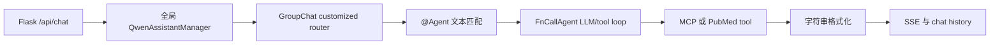
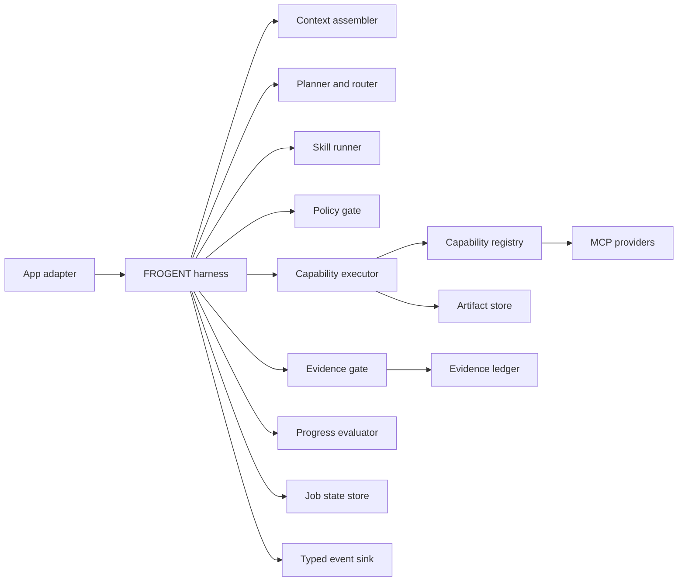

# FROGENT Harness

## 定义

FROGENT harness 是围绕模型、Agents、Skills、Apps 和 MCP providers 的控制系统。它负责一次 job 的 context 装配、规划、路由、策略检查、工具执行、evidence 准入、状态推进、事件输出、停止判断与恢复。

模型负责提出下一步意图。harness 决定该意图能否执行、执行结果进入哪个数据层、哪些内容允许进入工作 memory，以及 job 何时结束。

## v4 当前闭环

当前实现已经具备多 Agent、工具调用、最大轮次、最大模型调用次数、SSE 和会话历史。主要架构风险如下：

- Agent 路由依赖自然语言中的 `@Agent` 正则匹配，规划意图和展示文本耦合。
- 全局 Assistant、Agent Memory、文件列表和进程内 `user_sessions` 增加并发与跨 job 串扰风险。
- 完整 chat history 被重新拼接给 Agent，缺少按 job、证据资格和 token 预算控制的 context assembler。
- PubMed 仅返回标题、摘要和期刊的拼接字符串，缺少稳定标识、检索时间、查询来源和筛选状态。
- 工具错误、原始结果、Agent 发言和最终答案共用消息结构，错误信息可能被后续轮次当成事实。
- `max_round=40` 与单 Agent 模型调用上限分散在不同层，缺少统一 job policy、no-progress 检测和能力级预算。
- SSE 格式化、Agent 事件解析、历史持久化和断开处理交织在 Web route 与 Manager 内。

## 目标组件

| Component | Single responsibility |
|---|---|
| App adapter | Authenticate, normalize requests, stream events, expose artifacts |
| Harness controller | Apply transitions and budgets; own the job loop |
| Context assembler | Load bounded user input, approved evidence IDs, artifact refs, and required history |
| Planner and router | Emit typed commands with reasons and targets |
| Skill runner | Activate task procedures without owning provider URLs |
| Policy gate | Check phase, capability allowlist, limits, consent, and data boundaries |
| Capability executor | Resolve stable capability IDs and normalize provider results |
| Evidence gate | Preserve raw records, apply screening decisions, admit qualified excerpts |
| Progress evaluator | Measure task progress, detect repetition, request input, or stop |
| Stores | Persist state, artifacts, evidence, and traces through separate interfaces |
| Event sink | Convert typed events to SSE, WebSocket, CLI, or test traces at the boundary |

## Job loop

1. Create `ExecutionContext` and snapshot an exact evidence `as_of` date.
2. Enter `intake`; validate the request, files, identity, consent, and job limits.
3. Assemble a bounded context from user input, approved evidence IDs, artifact references, and the minimum necessary conversation state.
4. Enter `planning`; activate the relevant Skills and produce a typed `HarnessCommand`.
5. Apply `HarnessPolicy` and the phase-transition table before delegation or capability execution.
6. Execute one command. Store large or raw results as artifacts and return a normalized `ToolResult`.
7. Route literature results through `EvidenceLedger`. Keep excluded and uncertain records outside working memory.
8. Reconcile admitted evidence after every new screening decision, correction, or retraction.
9. Enter `evaluation`; measure progress, evidence sufficiency, repeated actions, errors, and remaining budget.
10. Persist a checkpoint and emit typed events. Continue, request input, complete, fail, or honor cancellation.

One loop iteration performs one externally visible decision. This keeps traces replayable and avoids recursive Agent-to-Agent execution.

## State and memory boundaries

`HarnessState` stores control data only: `run_id`, `as_of`, phase, counters, admitted evidence IDs, last target, and error. Raw prompts, full documents, provider payloads, model traces, and tool outputs stay outside the state object.

| Layer | Contents | Context eligibility |
|---|---|---|
| Conversation history | User-visible messages | Selected by context policy |
| Job state | Phase, limits, IDs, checkpoints | Always small |
| Artifact store | Files and raw provider payloads | Referenced on demand |
| Evidence ledger | Raw records and all screening events | Queried for audit or screening |
| Working memory | Qualified evidence excerpts and task facts | Directly available to planner |
| Synthesis | Claims linked to evidence and counterevidence IDs | Available after validation |

Local memory is scoped by `user_id`, `conversation_id`, and `job_id`. Promotion to longer-lived memory requires an explicit policy and provenance-preserving summary.

## Stop and recovery policy

The harness stops on a completed acceptance condition, required user input, user cancellation, policy denial, exhausted budget, repeated no-progress actions, unrecoverable provider failure, or evidence insufficiency that cannot be resolved within scope. Every stop carries a reason and final phase.

Checkpoint after each tool result, evidence decision, and synthesis update. A resumed job reloads IDs and state, reconciles evidence eligibility, and rehydrates artifacts through references.

## Evaluation surface

Deterministic tests cover transitions, capability allowlists, budgets, memory admission, evidence revocation, and typed events. Scenario evaluations should cover anchor-record recall, near-miss retention, negative evidence, duplicate study families, preprints, corrections, retractions, provider errors, cancellation, and concurrent jobs.

Useful trace metrics include unsupported-claim rate, citation precision, anchor recall, screening agreement, excluded-record reasons, memory admission count, evidence revocations, repeated commands, tool failure rate, and time to an acceptance condition.

## Migration sequence

1. Keep `app_v4.py` as a compatibility adapter while moving state and policy into the new harness contracts.
2. Convert Qwen GroupChat routing output into typed `HarnessCommand` objects.
3. Resolve MCP calls through `CapabilityRegistry`; remove duplicated URLs from Agent configuration.
4. Replace the in-process PubMed string tool with a literature provider that emits structured records and raw artifacts.
5. Insert context assembler, evidence gate, checkpoints, typed events, cancellation, and no-progress evaluation.
6. Move Web, database, artifact, and provider implementations behind ports after behavior is covered by trace fixtures.
